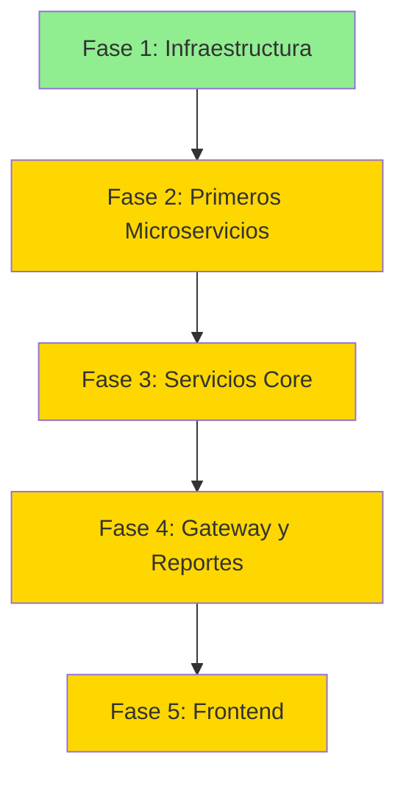

# 🗺️ ROADMAP MAESTRO - Migración a Microservicios Forestech Oil

> **Propósito:** Guía ejecutable para migrar la aplicación monolítica a microservicios mediante ejecución autónoma de fases por agentes IA.

---

## 📋 Índice de Fases

| Fase | Documento | Duración | Complejidad | Status |
|------|-----------|----------|-------------|--------|
| **Fase 1** | [FASE_1_INFRAESTRUCTURA.md](./FASE_1_INFRAESTRUCTURA.md) | 8-12h | ⭐⭐ | ⏳ Pendiente |
| **Fase 2** | [FASE_2_PRIMEROS_MICROSERVICIOS.md](./FASE_2_PRIMEROS_MICROSERVICIOS.md) | 12-16h | ⭐⭐⭐ | 🔒 Bloqueada |
| **Fase 3** | [FASE_3_SERVICIOS_CORE.md](./FASE_3_SERVICIOS_CORE.md) | 20-26h | ⭐⭐⭐⭐ | 🔒 Bloqueada |
| **Fase 4** | [FASE_4_GATEWAY_REPORTES.md](./FASE_4_GATEWAY_REPORTES.md) | 12-16h | ⭐⭐⭐ | 🔒 Bloqueada |
| **Fase 5** | [FASE_5_FRONTEND_FINALIZACION.md](./FASE_5_FRONTEND_FINALIZACION.md) | 18-24h | ⭐⭐⭐⭐ | 🔒 Bloqueada |

**Duración Total Estimada:** 70-94 horas

---

## 🎯 Objetivo General

Transformar la aplicación monolítica **Forestech Oil Management System** en una arquitectura de microservicios ejecutándose en contenedores Docker en un entorno local sin conexión a Internet.

---

## 📐 Arquitectura Objetivo

```
┌─────────────────────────────────────────────────────────────┐
│                  FORESTECH MICROSERVICES                     │
├─────────────────────────────────────────────────────────────┤
│                                                              │
│  ┌──────────────┐  ┌──────────────┐  ┌──────────────┐     │
│  │   Catalog    │  │    Fleet     │  │  Inventory   │     │
│  │  Service     │  │   Service    │  │   Service    │     │
│  │   :8081      │  │   :8082      │  │   :8083      │     │
│  └──────────────┘  └──────────────┘  └──────────────┘     │
│                                                              │
│  ┌──────────────┐  ┌──────────────┐  ┌──────────────┐     │
│  │   Partners   │  │   Invoicing  │  │   Reports    │     │
│  │   Service    │  │   Service    │  │   Service    │     │
│  │   :8084      │  │   :8085      │  │   :8086      │     │
│  └──────────────┘  └──────────────┘  └──────────────┘     │
│                                                              │
│  ┌────────────────────────────────────────────────┐        │
│  │         API Gateway (:8080)                     │        │
│  └────────────────────────────────────────────────┘        │
│                                                              │
│  ┌──────────────┐  ┌──────────────┐  ┌──────────────┐     │
│  │Config Server │  │   Consul     │  │    MySQL     │     │
│  │   :8888      │  │   :8500      │  │ (1 databases)│     │
│  └──────────────┘  └──────────────┘  └──────────────┘     │
└─────────────────────────────────────────────────────────────┘
```

---

## 🚀 Cómo Ejecutar Este Roadmap

### Para el Orquestador (Tú)

Asigna cada fase a un agente IA con estas instrucciones:

```bash
"Ejecuta la FASE_1_INFRAESTRUCTURA.md de forma autónoma.
Lee el documento completo, completa todas las tareas,
y genera el reporte de sesión especificado al final."
```

### Para los Agentes IA

Cada documento de fase contiene:
- ✅ **Pre-requisitos claros** (qué debe existir antes de empezar)
- ✅ **Tareas específicas y medibles** (qué hacer exactamente)
- ✅ **Criterios de éxito** (cuándo está completa)
- ✅ **Comandos de verificación** (cómo validar)
- ✅ **Formato de reporte** (qué documentar al finalizar)

---

## 📊 Métricas de Progreso

### Checklist Global

#### ✅ Pre-requisitos del Proyecto
- [ ] Docker instalado y funcionando
- [ ] Docker Compose instalado
- [ ] Maven configurado con `.m2/repository` completo
- [ ] Código fuente actual respaldado
- [ ] MySQL local funcionando

#### 🏗️ Fase 1: Infraestructura
- [ ] Estructura de directorios creada
- [ ] Docker Compose base configurado
- [ ] Consul funcionando
- [ ] Config Server funcionando
- [ ] 5 bases de datos MySQL creadas

#### 🔨 Fase 2: Primeros Microservicios
- [ ] catalog-service desplegado y funcionando
- [ ] fleet-service desplegado y funcionando
- [ ] Ambos registrados en Consul
- [ ] APIs REST documentadas con Swagger

#### ⚙️ Fase 3: Servicios Core
- [ ] inventory-service desplegado
- [ ] partners-service desplegado
- [ ] invoicing-service desplegado
- [ ] Comunicación entre servicios funcionando

#### 🌐 Fase 4: Gateway y Reportes
- [ ] API Gateway desplegado
- [ ] Routing configurado
- [ ] reports-service desplegado
- [ ] Redis cache funcionando

#### 🖥️ Fase 5: Frontend
- [ ] GUI Swing adaptada
- [ ] CLI adaptada
- [ ] Tests E2E pasando
- [ ] Documentación completa

---

## 🔄 Dependencias entre Fases



**Regla:** Una fase solo puede empezar cuando la anterior está 100% completa.

---

## 📝 Template de Reporte por Fase

Al completar cada fase, el agente debe generar:

```markdown
# REPORTE - Fase X - [Nombre de la Fase]

## 📅 Información General
- **Fecha de inicio:** YYYY-MM-DD HH:MM
- **Fecha de finalización:** YYYY-MM-DD HH:MM
- **Duración real:** X horas Y minutos
- **Agente ejecutor:** [Nombre/ID del agente]

## ✅ Tareas Completadas
- [x] Tarea 1 - Descripción
- [x] Tarea 2 - Descripción
- [x] Tarea 3 - Descripción

## 🚧 Tareas Pendientes (si las hay)
- [ ] Tarea pendiente 1 - Razón

## 🐛 Problemas Encontrados
### Problema 1: [Título]
- **Descripción:** [...]
- **Solución aplicada:** [...]
- **Tiempo perdido:** X minutos

## 📦 Artefactos Generados
- `path/to/file1.yml`
- `path/to/file2.java`
- `path/to/directory/`

## ✅ Verificación de Criterios de Éxito
- [x] Criterio 1 - Comando: `...` - Resultado: OK
- [x] Criterio 2 - Comando: `...` - Resultado: OK

## 🔗 Estado para Siguiente Fase
- **Fase desbloqueada:** Fase X+1
- **Pre-requisitos cumplidos:** [Lista]
- **Notas para siguiente agente:** [...]

## 📊 Métricas
- **Líneas de código generadas:** XXX
- **Archivos creados:** XX
- **Contenedores funcionando:** X/X
- **Tests ejecutados:** XX/XX pasaron
```

---

## 🛠️ Herramientas y Tecnologías

### Stack Tecnológico

| Componente | Tecnología | Versión |
|------------|------------|---------|
| **Lenguaje** | Java | 17 |
| **Build Tool** | Maven | 3.8+ |
| **Framework** | Spring Boot | 3.x |
| **Service Discovery** | Consul | 1.15 |
| **Config Management** | Spring Cloud Config | 4.x |
| **API Gateway** | Spring Cloud Gateway | 4.x |
| **Base de Datos** | MySQL | 8.0 |
| **Cache** | Redis | 7 |
| **Containerization** | Docker | 20.10+ |
| **Orchestration** | Docker Compose | 2.x |
| **Testing** | JUnit 5 + TestContainers | Latest |
| **Documentation** | SpringDoc OpenAPI | 2.x |

---

## 📂 Estructura de Directorios Final

```
forestech-microservices/
├── docker-compose.yml              # Orquestación de todos los servicios
├── .env                            # Variables de entorno
├── README.md                       # Documentación principal
├── ROADMAP_MAESTRO.md             # Este archivo
├── FASE_*.md                      # Documentos de fases
├── reportes/                       # Reportes generados por agentes
│   ├── REPORTE_FASE_1.md
│   ├── REPORTE_FASE_2.md
│   └── ...
├── services/                       # Microservicios
│   ├── catalog-service/
│   │   ├── src/
│   │   ├── pom.xml
│   │   ├── Dockerfile
│   │   └── README.md
│   ├── fleet-service/
│   ├── inventory-service/
│   ├── partners-service/
│   ├── invoicing-service/
│   ├── reports-service/
│   └── api-gateway/
├── infrastructure/                 # Servicios de infraestructura
│   ├── config-server/
│   │   ├── src/
│   │   ├── pom.xml
│   │   └── Dockerfile
│   ├── service-registry/
│   └── databases/
│       ├── catalog/
│       │   └── init.sql
│       ├── fleet/
│       ├── inventory/
│       ├── partners/
│       └── invoicing/
├── shared-libs/                    # Librerías compartidas
│   ├── common-models/
│   ├── common-exceptions/
│   └── common-utils/
├── scripts/                        # Scripts de utilidad
│   ├── start-all.sh
│   ├── stop-all.sh
│   ├── health-check.sh
│   ├── backup-databases.sh
│   └── e2e-test.sh
└── docs/                          # Documentación adicional
    ├── ARQUITECTURA.md
    ├── API_CONTRACTS.md
    └── TROUBLESHOOTING.md
```

---

## ⚠️ Reglas Importantes

### Para los Agentes IA

1. **Autonomía Total:** No pedir aprobación humana durante la ejecución de una fase
2. **Idempotencia:** Poder ejecutar la fase múltiples veces sin romper nada
3. **Rollback:** Si falla una tarea crítica, documentar estado y detener
4. **Verificación Continua:** Ejecutar comandos de verificación después de cada tarea importante
5. **Documentación Obligatoria:** Generar reporte al finalizar (exitosamente o no)

### Para el Orquestador

1. **Una Fase a la Vez:** No ejecutar fases en paralelo
2. **Revisión de Reportes:** Revisar el reporte antes de desbloquear siguiente fase
3. **Backup Antes de Empezar:** Respaldar estado actual antes de cada fase
4. **Validación de Pre-requisitos:** Verificar que se cumplan antes de asignar fase

---

## 🎯 Criterios de Éxito del Proyecto Completo

El proyecto se considerará exitoso cuando:

- [x] **Infraestructura:** Todos los contenedores arrancando con `docker-compose up -d`
- [ ] **Microservicios:** 7 servicios registrados en Consul y respondiendo health checks
- [ ] **API Gateway:** Routing a todos los servicios funcionando
- [ ] **Bases de Datos:** 5 bases MySQL con esquemas migrados
- [ ] **Frontend:** GUI Swing y CLI consumiendo API Gateway
- [ ] **Tests E2E:** Al menos 5 flujos completos pasando
- [ ] **Documentación:** Guías de despliegue, troubleshooting y API contracts
- [ ] **Performance:** Respuesta < 500ms en el 95% de requests

---

## 🔗 Siguientes Pasos

### Paso 1: Preparación
```bash
# Verificar pre-requisitos
docker --version
docker-compose --version
mvn --version
mysql --version

# Crear directorio base
mkdir -p forestech-microservices
cd forestech-microservices
```

### Paso 2: Ejecutar Fase 1
```bash
# Asignar a agente IA:
"Lee y ejecuta FASE_1_INFRAESTRUCTURA.md completamente.
Genera el reporte REPORTE_FASE_1.md al finalizar."
```

### Paso 3: Revisar Reporte
```bash
# Verificar que todo pasó
cat reportes/REPORTE_FASE_1.md

# Validar criterios de éxito
./scripts/health-check.sh
```

### Paso 4: Continuar con Fase 2
```bash
# Solo si Fase 1 está 100% completa
"Lee y ejecuta FASE_2_PRIMEROS_MICROSERVICIOS.md completamente.
Genera el reporte REPORTE_FASE_2.md al finalizar."
```

---

## 📞 Soporte y Troubleshooting

### Logs de Servicios
```bash
# Ver logs de todos los servicios
docker-compose logs -f

# Ver logs de un servicio específico
docker-compose logs -f catalog-service
```

### Reiniciar Sistema
```bash
# Detener todo
docker-compose down

# Limpiar volúmenes (¡CUIDADO! Borra datos)
docker-compose down -v

# Reiniciar
docker-compose up -d
```

### Estado de Servicios
```bash
# Ver servicios registrados en Consul
curl http://localhost:8500/v1/catalog/services | jq

# Health check de un servicio
curl http://localhost:8081/actuator/health | jq
```

---

## 📊 Dashboard de Progreso

| Métrica | Objetivo | Actual | Status |
|---------|----------|--------|--------|
| **Fases Completadas** | 5 | 0 | ⏳ |
| **Microservicios Desplegados** | 7 | 0 | ⏳ |
| **Tests E2E Pasando** | 10 | 0 | ⏳ |
| **Cobertura de Tests** | >80% | 0% | ⏳ |
| **Documentación** | 100% | 20% | 🟡 |

---

**Versión:** 1.0  
**Fecha Creación:** 2025-11-19  
**Última Actualización:** 2025-11-19  
**Mantenedor:** Forestech Development Team
