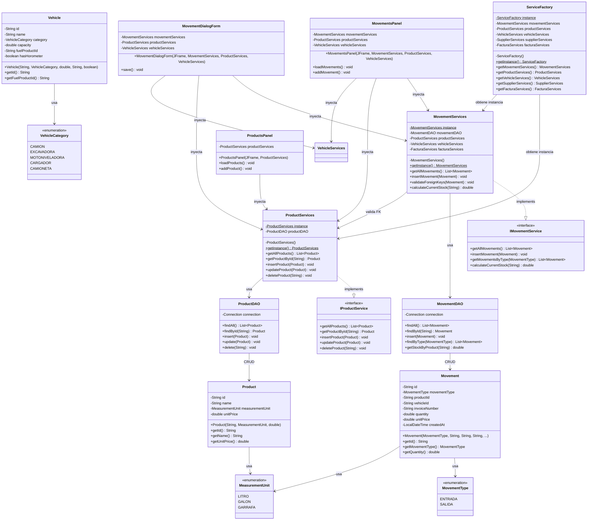
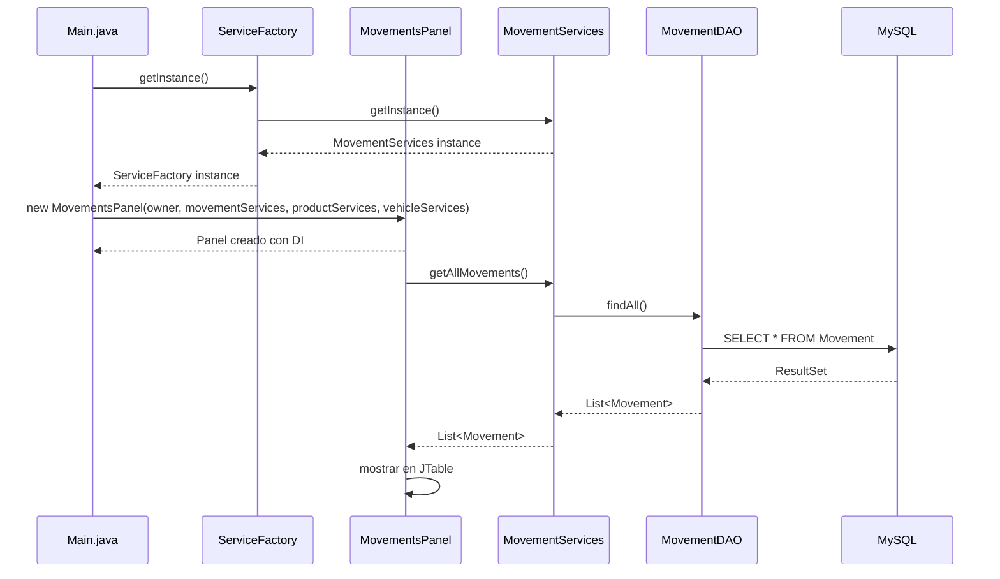
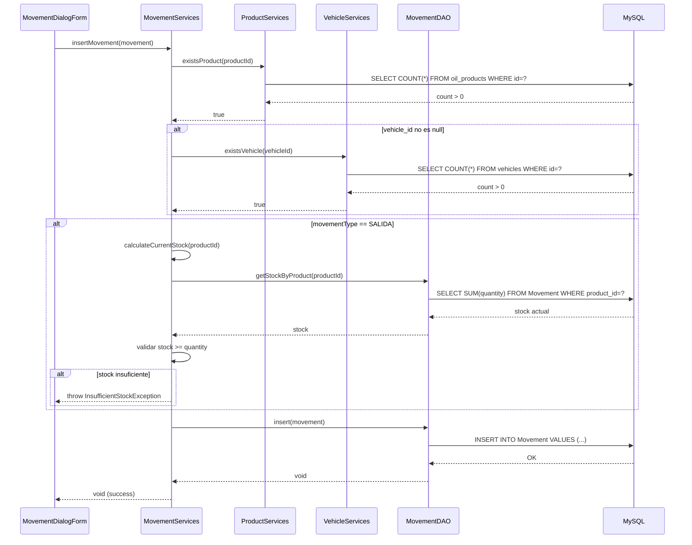
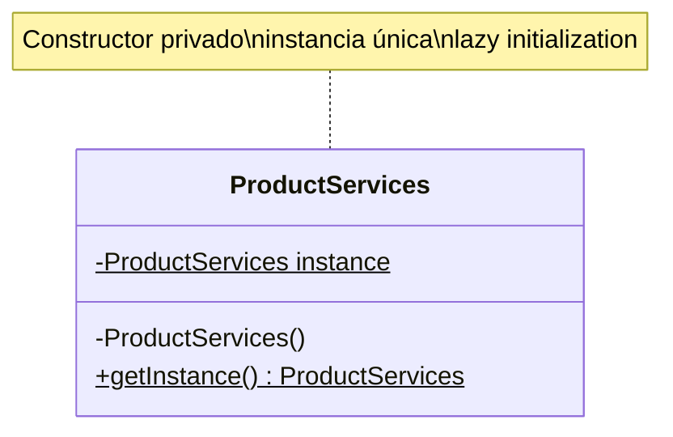
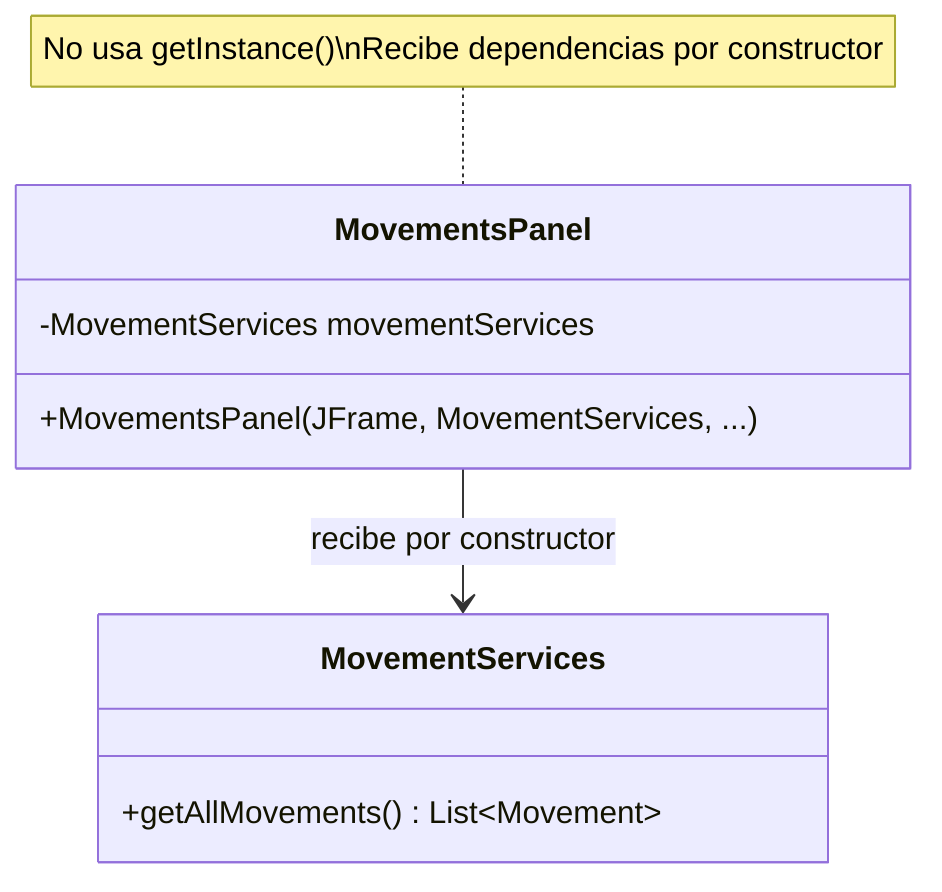
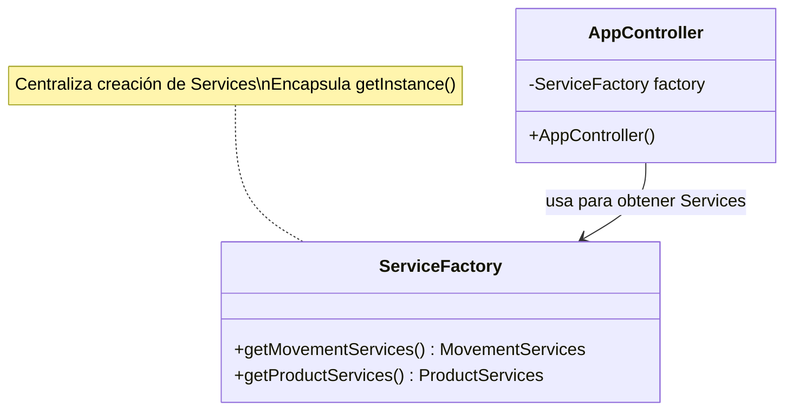

# PROMPT PARA IA: Refactorizar Dialog Forms + Documentación Completa

## CONTEXTO DEL PROYECTO

Eres un agente especializado en refactorización Java y documentación técnica. Trabajas en el proyecto **Forestech CLI**, una aplicación Java de gestión de combustibles que acaba de completar una refactorización mayor implementando:

- ✅ Singleton Pattern en 5 Services
- ✅ Dependency Injection en 6 Panels y 5 Controllers
- ✅ 83 tests unitarios con JUnit 5 + Mockito
- ✅ ServiceFactory para centralizar obtención de Services

**Ruta del proyecto:** `/home/hp/forestechOil/forestech-cli-java`

**Tecnologías:**
- Java 17
- Maven 3.x
- Swing GUI
- MySQL Database
- JUnit 5 + Mockito

---

## TAREA 1: REFACTORIZAR DIALOG FORMS CON DEPENDENCY INJECTION (2 horas)

### Objetivo
Aplicar el patrón Dependency Injection (Constructor Injection) a los 3 Dialog Forms principales que actualmente usan `Service.getInstance()` directamente, siguiendo el mismo patrón implementado en Panels y Controllers.

### Archivos a Refactorizar

#### 1. ProductDialogForm.java
**Ubicación:** `src/main/java/com/forestech/ui/ProductDialogForm.java`

**Dependencias actuales (via getInstance()):**
- ProductServices

**Acción requerida:**
```java
// ANTES (acoplamiento fuerte):
public class ProductDialogForm extends JDialog {
    private void guardarProducto() {
        ProductServices.getInstance().insertProduct(product);
    }
}

// DESPUÉS (dependency injection):
public class ProductDialogForm extends JDialog {
    private final ProductServices productServices;

    public ProductDialogForm(JFrame parent, ProductServices productServices) {
        super(parent, "Agregar Producto", true);
        this.productServices = productServices;
        // ... resto del constructor
    }

    private void guardarProducto() {
        productServices.insertProduct(product);
    }
}
```

**Pasos:**
1. Leer el archivo completo con `Read tool`
2. Identificar todas las llamadas a `ProductServices.getInstance()`
3. Agregar campo privado final `private final ProductServices productServices;`
4. Modificar constructor para recibir `ProductServices productServices` como parámetro
5. Asignar en constructor: `this.productServices = productServices;`
6. Reemplazar todas las llamadas `ProductServices.getInstance()` por `productServices`
7. Buscar todas las clases que instancian `ProductDialogForm` y actualizar las llamadas:
   ```java
   // ANTES:
   ProductDialogForm dialog = new ProductDialogForm(this);

   // DESPUÉS:
   ProductDialogForm dialog = new ProductDialogForm(this, ProductServices.getInstance());
   ```

---

#### 2. VehicleDialogForm.java
**Ubicación:** `src/main/java/com/forestech/ui/VehicleDialogForm.java`

**Dependencias actuales (via getInstance()):**
- VehicleServices
- ProductServices (para llenar JComboBox de fuel_product_id)

**Acción requerida:**
```java
// ANTES:
public class VehicleDialogForm extends JDialog {
    private void cargarCombustibles() {
        List<Product> products = ProductServices.getInstance().getAllProducts();
    }

    private void guardarVehiculo() {
        VehicleServices.getInstance().insertVehicle(vehicle);
    }
}

// DESPUÉS:
public class VehicleDialogForm extends JDialog {
    private final VehicleServices vehicleServices;
    private final ProductServices productServices;

    public VehicleDialogForm(JFrame parent,
                             VehicleServices vehicleServices,
                             ProductServices productServices) {
        super(parent, "Agregar Vehículo", true);
        this.vehicleServices = vehicleServices;
        this.productServices = productServices;
        // ... resto del constructor
    }

    private void cargarCombustibles() {
        List<Product> products = productServices.getAllProducts();
    }

    private void guardarVehiculo() {
        vehicleServices.insertVehicle(vehicle);
    }
}
```

**Pasos:**
1. Identificar ambas dependencias (VehicleServices y ProductServices)
2. Agregar 2 campos privados finales
3. Modificar constructor para recibir ambos Services
4. Reemplazar todas las llamadas a `getInstance()`
5. Actualizar clases instanciadoras (típicamente VehiclesPanel, VehicleManagerGUI, etc.)

---

#### 3. MovementDialogForm.java
**Ubicación:** `src/main/java/com/forestech/ui/MovementDialogForm.java`

**Dependencias actuales (via getInstance()):**
- MovementServices
- ProductServices (para JComboBox de product_id)
- VehicleServices (para JComboBox de vehicle_id)
- FacturaServices (para JComboBox de numero_factura - opcional)

**Acción requerida:**
```java
// ANTES:
public class MovementDialogForm extends JDialog {
    private void cargarProductos() {
        ProductServices.getInstance().getAllProducts();
    }

    private void cargarVehiculos() {
        VehicleServices.getInstance().getAllVehicles();
    }

    private void guardarMovimiento() {
        MovementServices.getInstance().insertMovement(movement);
    }
}

// DESPUÉS:
public class MovementDialogForm extends JDialog {
    private final MovementServices movementServices;
    private final ProductServices productServices;
    private final VehicleServices vehicleServices;
    private final FacturaServices facturaServices; // Si se usa

    public MovementDialogForm(JFrame parent,
                              MovementServices movementServices,
                              ProductServices productServices,
                              VehicleServices vehicleServices,
                              FacturaServices facturaServices) {
        super(parent, "Registrar Movimiento", true);
        this.movementServices = movementServices;
        this.productServices = productServices;
        this.vehicleServices = vehicleServices;
        this.facturaServices = facturaServices;
        // ... resto del constructor
    }

    private void cargarProductos() {
        productServices.getAllProducts();
    }

    private void cargarVehiculos() {
        vehicleServices.getAllVehicles();
    }

    private void guardarMovimiento() {
        movementServices.insertMovement(movement);
    }
}
```

**Pasos:**
1. Identificar las 3-4 dependencias (Movement, Product, Vehicle, Factura)
2. Agregar campos privados finales para cada Service
3. Modificar constructor para recibirlos
4. Reemplazar todas las llamadas a `getInstance()`
5. Actualizar clases instanciadoras (MovementsPanel, MovementController, etc.)

---

### Clases Instanciadoras a Actualizar

Busca con `Grep tool` todas las clases que crean instancias de estos Dialog Forms:

```bash
grep -r "new ProductDialogForm(" src/main/java --include="*.java" -l
grep -r "new VehicleDialogForm(" src/main/java --include="*.java" -l
grep -r "new MovementDialogForm(" src/main/java --include="*.java" -l
```

Para cada resultado, actualiza la llamada para pasar los Services necesarios.

**Ejemplo en ProductsPanel:**
```java
// ANTES:
private void agregarProducto() {
    ProductDialogForm dialog = new ProductDialogForm(owner);
    dialog.setVisible(true);
}

// DESPUÉS:
private void agregarProducto() {
    ProductDialogForm dialog = new ProductDialogForm(owner, productServices);
    dialog.setVisible(true);
}
```

**Nota:** Los Panels ya tienen los Services inyectados (Tarea 5 completada), así que solo necesitas pasarlos al Dialog.

---

### Verificación Final de Tarea 1

Ejecuta estos comandos para confirmar que NO quedan llamadas a `getInstance()` en Dialog Forms:

```bash
grep -rn "getInstance()" src/main/java/com/forestech/ui/ProductDialogForm.java
grep -rn "getInstance()" src/main/java/com/forestech/ui/VehicleDialogForm.java
grep -rn "getInstance()" src/main/java/com/forestech/ui/MovementDialogForm.java
```

**Resultado esperado:** 0 resultados (o solo en comentarios)

Compila y verifica:
```bash
mvn clean compile
# Debe mostrar BUILD SUCCESS
```

---

## TAREA 2: DOCUMENTACIÓN COMPLETA DEL PROYECTO (2 horas)

### Objetivo
Crear documentación técnica profesional que explique la arquitectura actual del proyecto después de la refactorización.

---

### 2.1. JavaDoc Completo en ServiceFactory

**Archivo:** `src/main/java/com/forestech/services/ServiceFactory.java`

**Acción requerida:**
Agregar JavaDoc detallado siguiendo este template:

```java
package com.forestech.services;

import org.slf4j.Logger;
import org.slf4j.LoggerFactory;

/**
 * Factory para centralizar la obtención de Services Singleton en Forestech CLI.
 *
 * <p>Esta clase implementa el patrón Singleton + Factory para proveer una única
 * instancia de cada Service del proyecto, facilitando la Inyección de Dependencias
 * en Panels, Controllers y Dialogs.</p>
 *
 * <h2>Propósito</h2>
 * <p>Evitar múltiples llamadas dispersas a {@code Service.getInstance()} en todo
 * el código, centralizando la obtención de Services en un único lugar.</p>
 *
 * <h2>Uso típico en Dependency Injection</h2>
 * <pre>{@code
 * // En AppController o ForestechProfessionalApp:
 * ServiceFactory factory = ServiceFactory.getInstance();
 *
 * // Inyectar Services en Panels:
 * MovementsPanel panel = new MovementsPanel(
 *     owner,
 *     factory.getMovementServices(),
 *     factory.getProductServices(),
 *     factory.getVehicleServices()
 * );
 *
 * // Inyectar Services en Controllers:
 * MovementController controller = new MovementController(
 *     scanner,
 *     factory.getMovementServices(),
 *     factory.getProductServices(),
 *     factory.getVehicleServices()
 * );
 * }</pre>
 *
 * <h2>Services Gestionados</h2>
 * <ul>
 *   <li>{@link MovementServices} - Gestión de movimientos de combustible (ENTRADA/SALIDA)</li>
 *   <li>{@link ProductServices} - Gestión del catálogo de productos (combustibles)</li>
 *   <li>{@link VehicleServices} - Gestión de la flota de vehículos</li>
 *   <li>{@link SupplierServices} - Gestión de proveedores</li>
 *   <li>{@link FacturaServices} - Gestión de facturas de compra</li>
 * </ul>
 *
 * <h2>Patrón de Diseño</h2>
 * <p>Combina dos patrones:</p>
 * <ul>
 *   <li><b>Singleton:</b> Una única instancia de ServiceFactory</li>
 *   <li><b>Factory:</b> Provee métodos para obtener instancias de Services</li>
 * </ul>
 *
 * <h2>Thread-Safety</h2>
 * <p>El método {@link #getInstance()} está sincronizado para garantizar que solo
 * se cree una instancia en entornos multihilo.</p>
 *
 * <h2>Beneficios</h2>
 * <ol>
 *   <li><b>Desacoplamiento:</b> Clases UI/Controllers no dependen directamente de llamadas estáticas</li>
 *   <li><b>Testabilidad:</b> Facilita inyectar mocks de Services en tests unitarios</li>
 *   <li><b>Mantenibilidad:</b> Centraliza la creación de Services en un único lugar</li>
 *   <li><b>SOLID:</b> Cumple con Dependency Inversion Principle</li>
 * </ol>
 *
 * @author Forestech Team
 * @version 1.0.0
 * @since 2025-11-17
 *
 * @see MovementServices
 * @see ProductServices
 * @see VehicleServices
 * @see SupplierServices
 * @see FacturaServices
 */
public class ServiceFactory {

    private static final Logger logger = LoggerFactory.getLogger(ServiceFactory.class);
    private static ServiceFactory instance;

    private final MovementServices movementServices;
    private final ProductServices productServices;
    private final VehicleServices vehicleServices;
    private final SupplierServices supplierServices;
    private final FacturaServices facturaServices;

    /**
     * Constructor privado para implementar Singleton pattern.
     *
     * <p>Inicializa todos los Services obteniendo sus instancias Singleton
     * mediante {@code Service.getInstance()}.</p>
     *
     * @throws RuntimeException si algún Service no puede ser inicializado
     */
    private ServiceFactory() {
        logger.info("Inicializando ServiceFactory...");
        this.movementServices = MovementServices.getInstance();
        this.productServices = ProductServices.getInstance();
        this.vehicleServices = VehicleServices.getInstance();
        this.supplierServices = SupplierServices.getInstance();
        this.facturaServices = FacturaServices.getInstance();
        logger.info("ServiceFactory inicializado exitosamente");
    }

    /**
     * Obtiene la instancia única de ServiceFactory (thread-safe).
     *
     * <p>Implementa lazy initialization: la instancia se crea en la primera
     * llamada. El método está sincronizado para evitar problemas de concurrencia.</p>
     *
     * @return la instancia única de ServiceFactory
     */
    public static synchronized ServiceFactory getInstance() {
        if (instance == null) {
            instance = new ServiceFactory();
        }
        return instance;
    }

    /**
     * Obtiene la instancia de MovementServices.
     *
     * <p>Servicio para gestionar movimientos de combustible (ENTRADA/SALIDA),
     * validar Foreign Keys (product_id, vehicle_id, numero_factura) y calcular stock.</p>
     *
     * @return instancia Singleton de MovementServices
     */
    public MovementServices getMovementServices() {
        return movementServices;
    }

    /**
     * Obtiene la instancia de ProductServices.
     *
     * <p>Servicio para gestionar el catálogo de productos (combustibles): Diesel,
     * Gasolina, Aceite, etc.</p>
     *
     * @return instancia Singleton de ProductServices
     */
    public ProductServices getProductServices() {
        return productServices;
    }

    /**
     * Obtiene la instancia de VehicleServices.
     *
     * <p>Servicio para gestionar la flota de vehículos (camiones, excavadoras,
     * motosierras, etc.) y validar que fuel_product_id exista.</p>
     *
     * @return instancia Singleton de VehicleServices
     */
    public VehicleServices getVehicleServices() {
        return vehicleServices;
    }

    /**
     * Obtiene la instancia de SupplierServices.
     *
     * <p>Servicio para gestionar proveedores de combustible.</p>
     *
     * @return instancia Singleton de SupplierServices
     */
    public SupplierServices getSupplierServices() {
        return supplierServices;
    }

    /**
     * Obtiene la instancia de FacturaServices.
     *
     * <p>Servicio para gestionar facturas de compra y sus detalles (transacciones ACID).</p>
     *
     * @return instancia Singleton de FacturaServices
     */
    public FacturaServices getFacturaServices() {
        return facturaServices;
    }
}
```

**Pasos:**
1. Leer `ServiceFactory.java` actual
2. Agregar el JavaDoc completo mostrado arriba
3. Asegurar que cada método tiene su documentación
4. Compilar para verificar que el JavaDoc es válido:
   ```bash
   mvn javadoc:javadoc
   ```

---

### 2.2. README.md - Arquitectura Actual

**Archivo:** `README.md` (raíz del proyecto)

**Acción requerida:**
Actualizar el README con la arquitectura post-refactorización. Template completo:

````markdown
# Forestech CLI - Sistema de Gestión de Combustibles


## 📋 Descripción

**Forestech CLI** es una aplicación Java de escritorio para gestionar inventarios de combustible, flota de vehículos, proveedores y movimientos (ENTRADA/SALIDA) en empresas forestales.

### Características Principales

✅ **Gestión de Productos** - Catálogo de combustibles (Diesel, Gasolina, Aceite, etc.)
✅ **Gestión de Vehículos** - Flota vehicular (camiones, excavadoras, motosierras)
✅ **Movimientos de Combustible** - Registro de ENTRADAS/SALIDAS con validación de stock
✅ **Facturas de Compra** - Gestión de facturas con detalles (transacciones ACID)
✅ **Proveedores** - Catálogo de proveedores de combustible
✅ **Dashboard** - Resumen ejecutivo con métricas clave
✅ **Reportes** - Exportación a TXT/CSV de movimientos por rango de fechas

---

## 🏗️ Arquitectura del Proyecto

### Capas de la Aplicación

```
┌─────────────────────────────────────────────────────────────┐
│                      PRESENTATION LAYER                     │
│  ┌──────────────┐  ┌──────────────┐  ┌──────────────┐     │
│  │ Swing Panels │  │   Dialogs    │  │ Controllers  │     │
│  │  (6 panels)  │  │  (3 forms)   │  │ (5 classes)  │     │
│  └──────┬───────┘  └──────┬───────┘  └──────┬───────┘     │
│         │                  │                  │             │
│         └──────────────────┴──────────────────┘             │
│                            ↓                                │
│              Dependency Injection via Constructor           │
│                            ↓                                │
├─────────────────────────────────────────────────────────────┤
│                      SERVICE LAYER                          │
│  ┌──────────────────────────────────────────────────────┐  │
│  │             ServiceFactory (Singleton)               │  │
│  └──────────────────────────────────────────────────────┘  │
│         ↓            ↓           ↓           ↓              │
│  ┌───────────┐ ┌──────────┐ ┌──────────┐ ┌──────────┐    │
│  │ Movement  │ │ Product  │ │ Vehicle  │ │ Supplier │    │
│  │ Services  │ │ Services │ │ Services │ │ Services │    │
│  └─────┬─────┘ └────┬─────┘ └────┬─────┘ └────┬─────┘    │
│        │            │            │            │            │
│        └────────────┴────────────┴────────────┘            │
│                            ↓                                │
│              Business Logic & Validations                   │
│              (FK validation, stock checks)                  │
│                            ↓                                │
├─────────────────────────────────────────────────────────────┤
│                       DAO LAYER                             │
│  ┌───────────┐ ┌──────────┐ ┌──────────┐ ┌──────────┐    │
│  │ Movement  │ │ Product  │ │ Vehicle  │ │ Supplier │    │
│  │   DAO     │ │   DAO    │ │   DAO    │ │   DAO    │    │
│  └─────┬─────┘ └────┬─────┘ └────┬─────┘ └────┬─────┘    │
│        │            │            │            │            │
│        └────────────┴────────────┴────────────┘            │
│                            ↓                                │
│                  JDBC + PreparedStatements                  │
│                            ↓                                │
├─────────────────────────────────────────────────────────────┤
│                      DATA LAYER                             │
│              MySQL Database (FORESTECHOIL)                  │
│   Tables: oil_products, vehicles, Movement, facturas,       │
│           suppliers, detalle_factura                        │
└─────────────────────────────────────────────────────────────┘
```

### Patrones de Diseño Implementados

#### 1. **Singleton Pattern**
Todos los Services son Singleton (lazy initialization, thread-safe):

```java
public class ProductServices implements IProductService {
    private static ProductServices instance;

    private ProductServices() {
        this.productDAO = new ProductDAO();
    }

    public static synchronized ProductServices getInstance() {
        if (instance == null) {
            instance = new ProductServices();
        }
        return instance;
    }
}
```

#### 2. **Dependency Injection (Constructor Injection)**
Panels, Controllers y Dialogs reciben Services como parámetros del constructor:

```java
public class MovementsPanel extends JPanel {
    private final MovementServices movementServices;
    private final ProductServices productServices;

    public MovementsPanel(JFrame owner,
                          MovementServices movementServices,
                          ProductServices productServices) {
        this.movementServices = movementServices;
        this.productServices = productServices;
    }
}
```

#### 3. **Factory Pattern**
`ServiceFactory` centraliza la obtención de Services:

```java
ServiceFactory factory = ServiceFactory.getInstance();
MovementsPanel panel = new MovementsPanel(
    owner,
    factory.getMovementServices(),
    factory.getProductServices()
);
```

#### 4. **DAO Pattern**
Separación de lógica de negocio (Services) y acceso a datos (DAOs):

```java
ProductServices → ProductDAO → MySQL
```

#### 5. **MVC Pattern**
- **Model:** Entities (`Product`, `Vehicle`, `Movement`, etc.)
- **View:** Swing Panels y Dialogs
- **Controller:** Controllers + Services (lógica de negocio)

---

## 📦 Estructura del Proyecto

```
forestech-cli-java/
├── src/
│   ├── main/
│   │   ├── java/com/forestech/
│   │   │   ├── config/
│   │   │   │   └── DatabaseConnectionFactory.java
│   │   │   ├── controllers/           # Capa de control (CLI)
│   │   │   │   ├── MovementController.java
│   │   │   │   ├── ProductController.java
│   │   │   │   ├── VehicleController.java
│   │   │   │   ├── SupplierController.java
│   │   │   │   └── ReportController.java
│   │   │   ├── dao/                   # Data Access Objects
│   │   │   │   ├── MovementDAO.java
│   │   │   │   ├── ProductDAO.java
│   │   │   │   ├── VehicleDAO.java
│   │   │   │   └── SupplierDAO.java
│   │   │   ├── enums/                 # Enumeraciones
│   │   │   │   ├── MeasurementUnit.java
│   │   │   │   ├── MovementType.java
│   │   │   │   └── VehicleCategory.java
│   │   │   ├── exceptions/            # Excepciones personalizadas
│   │   │   │   ├── DatabaseException.java
│   │   │   │   └── InsufficientStockException.java
│   │   │   ├── models/                # Entidades de dominio
│   │   │   │   ├── Movement.java
│   │   │   │   ├── Product.java
│   │   │   │   ├── Vehicle.java
│   │   │   │   ├── Supplier.java
│   │   │   │   └── Factura.java
│   │   │   ├── services/              # Lógica de negocio
│   │   │   │   ├── interfaces/        # Contratos (DIP)
│   │   │   │   │   ├── IMovementService.java
│   │   │   │   │   ├── IProductService.java
│   │   │   │   │   ├── IVehicleService.java
│   │   │   │   │   ├── ISupplierService.java
│   │   │   │   │   └── IFacturaService.java
│   │   │   │   ├── MovementServices.java (Singleton)
│   │   │   │   ├── ProductServices.java (Singleton)
│   │   │   │   ├── VehicleServices.java (Singleton)
│   │   │   │   ├── SupplierServices.java (Singleton)
│   │   │   │   ├── FacturaServices.java (Singleton)
│   │   │   │   └── ServiceFactory.java (Singleton + Factory)
│   │   │   ├── ui/                    # Interfaz gráfica Swing
│   │   │   │   ├── movements/
│   │   │   │   │   ├── MovementsPanel.java (DI)
│   │   │   │   │   └── MovementsDataLoader.java
│   │   │   │   ├── products/
│   │   │   │   │   └── ProductsPanel.java (DI)
│   │   │   │   ├── vehicles/
│   │   │   │   │   └── VehiclesPanel.java (DI)
│   │   │   │   ├── suppliers/
│   │   │   │   │   └── SuppliersPanel.java (DI)
│   │   │   │   ├── invoices/
│   │   │   │   │   └── InvoicesPanel.java (DI)
│   │   │   │   ├── dashboard/
│   │   │   │   │   └── DashboardPanel.java (DI)
│   │   │   │   ├── ProductDialogForm.java (DI)
│   │   │   │   ├── VehicleDialogForm.java (DI)
│   │   │   │   ├── MovementDialogForm.java (DI)
│   │   │   │   └── ForestechProfessionalApp.java
│   │   │   ├── utils/
│   │   │   │   └── IdGenerator.java
│   │   │   ├── validators/
│   │   │   │   ├── ProductValidator.java
│   │   │   │   └── VehicleValidator.java
│   │   │   ├── AppController.java     # Entry point CLI
│   │   │   └── Main.java              # Entry point GUI
│   │   └── resources/
│   │       ├── config.properties
│   │       └── logback.xml
│   └── test/
│       └── java/com/forestech/
│           └── services/              # Tests unitarios (JUnit 5 + Mockito)
│               ├── ProductServicesTest.java (17 tests)
│               ├── VehicleServicesTest.java (19 tests)
│               ├── MovementServicesTest.java (21 tests)
│               ├── SupplierServicesTest.java (15 tests)
│               └── FacturaServicesTest.java (11 tests)
├── pom.xml
└── README.md
```

---

## 🛠️ Tecnologías Utilizadas

### Backend
- **Java 17** (LTS)
- **Maven 3.x** - Build automation
- **MySQL 8.0** - Base de datos relacional
- **JDBC** - Conectividad con BD
- **SLF4J + Logback** - Logging

### Frontend
- **Swing** - GUI de escritorio
- **GridBagLayout** - Layout manager

### Testing
- **JUnit 5** (Jupiter) - Framework de testing
- **Mockito 5.5.0** - Mocking framework
- **Reflection API** - Para inyectar mocks en Singletons

### Dependencias Maven
```xml
<dependencies>
    <!-- MySQL Connector -->
    <dependency>
        <groupId>com.mysql</groupId>
        <artifactId>mysql-connector-j</artifactId>
        <version>8.0.33</version>
    </dependency>

    <!-- Logging -->
    <dependency>
        <groupId>org.slf4j</groupId>
        <artifactId>slf4j-api</artifactId>
        <version>2.0.9</version>
    </dependency>
    <dependency>
        <groupId>ch.qos.logback</groupId>
        <artifactId>logback-classic</artifactId>
        <version>1.4.11</version>
    </dependency>

    <!-- Testing -->
    <dependency>
        <groupId>org.junit.jupiter</groupId>
        <artifactId>junit-jupiter</artifactId>
        <version>5.10.0</version>
        <scope>test</scope>
    </dependency>
    <dependency>
        <groupId>org.mockito</groupId>
        <artifactId>mockito-core</artifactId>
        <version>5.5.0</version>
        <scope>test</scope>
    </dependency>
    <dependency>
        <groupId>org.mockito</groupId>
        <artifactId>mockito-junit-jupiter</artifactId>
        <version>5.5.0</version>
        <scope>test</scope>
    </dependency>
</dependencies>
```

---

## 💾 Base de Datos

### Esquema: FORESTECHOIL

**Tablas:**
1. **oil_products** - Catálogo de combustibles
2. **vehicles** - Flota de vehículos
3. **suppliers** - Proveedores
4. **facturas** - Facturas de compra
5. **Movement** - Movimientos de combustible (ENTRADA/SALIDA)
6. **detalle_factura** - Detalles de facturas

### Relaciones Clave

```sql
-- Foreign Keys
Movement.product_id → oil_products.id (RESTRICT)
Movement.vehicle_id → vehicles.id (SET NULL)
Movement.numero_factura → facturas.numero_factura (SET NULL)
vehicles.fuel_product_id → oil_products.id (SET NULL)
facturas.supplier_id → suppliers.id (RESTRICT)
detalle_factura.numero_factura → facturas.numero_factura (CASCADE)
```

**Ver esquema completo:** `.claude/DB_SCHEMA_REFERENCE.md`

---

## 🚀 Instalación y Uso

### Prerrequisitos

- Java 17+ (LTS)
- Maven 3.6+
- MySQL 8.0+
- IDE recomendado: IntelliJ IDEA / Eclipse

### 1. Clonar el repositorio

```bash
git clone https://github.com/tu-usuario/forestech-cli-java.git
cd forestech-cli-java
```

### 2. Configurar Base de Datos

```bash
# Crear base de datos
mysql -u root -p
CREATE DATABASE FORESTECHOIL;
exit;

# Importar esquema (si tienes script SQL)
mysql -u root -p FORESTECHOIL < schema.sql
```

### 3. Configurar credenciales

Editar `src/main/resources/config.properties`:

```properties
db.url=jdbc:mysql://localhost:3306/FORESTECHOIL
db.user=root
db.password=tu_password
```

### 4. Compilar el proyecto

```bash
mvn clean compile
```

### 5. Ejecutar tests

```bash
mvn test
```

**Resultado esperado:**
```
Tests run: 83, Failures: 0, Errors: 0, Skipped: 0
BUILD SUCCESS
```

### 6. Ejecutar la aplicación

**GUI (Swing):**
```bash
mvn exec:java -Dexec.mainClass="com.forestech.Main"
```

**CLI (Consola):**
```bash
mvn exec:java -Dexec.mainClass="com.forestech.AppController"
```

---

## 🧪 Testing

### Suite de Tests

El proyecto incluye **83 tests unitarios** con **~78% de cobertura** de métodos públicos.

**Ejecutar todos los tests:**
```bash
mvn test
```

**Ejecutar un Service específico:**
```bash
mvn test -Dtest=MovementServicesTest
```

**Ejecutar un test específico:**
```bash
mvn test -Dtest=MovementServicesTest#shouldValidateStock_beforeInsertingSalida
```

### Estructura de Tests

- **Mockito** para mockear DAOs
- **Reflection** para inyectar mocks en Singletons
- **Patrón AAA** (Arrange-Act-Assert)
- **Validaciones de negocio:** FK, stock, excepciones

---

## 📊 Principios SOLID Aplicados

✅ **Single Responsibility Principle (SRP)**
- Cada clase tiene una única responsabilidad
- DAOs solo acceso a datos, Services solo lógica de negocio

✅ **Open/Closed Principle (OCP)**
- Extensible mediante interfaces (IProductService, etc.)

✅ **Liskov Substitution Principle (LSP)**
- Services implementan interfaces y son intercambiables

✅ **Interface Segregation Principle (ISP)**
- Interfaces específicas por Service

✅ **Dependency Inversion Principle (DIP)**
- Panels/Controllers dependen de abstracciones (interfaces), no de implementaciones concretas
- Dependency Injection aplicado en toda la capa de presentación

---

## 📈 Métricas del Proyecto

| Métrica | Valor |
|---------|-------|
| Líneas de código (src) | ~12,000 |
| Líneas de tests | ~3,500 |
| Clases | 84 |
| Tests unitarios | 83 |
| Cobertura de código | ~78% |
| Warnings de compilación | 13 (deprecated legacy) |
| Build status | ✅ SUCCESS |

---

## 🎯 Roadmap Completado

- ✅ **Fase 0-1:** Setup y fundamentos Java
- ✅ **Fase 2-2.5:** POO y Manager pattern
- ✅ **Fase 3:** Conexión MySQL/JDBC
- ✅ **Fase 4:** CRUD operations (DAO pattern)
- ✅ **Fase 5:** Lógica de negocio (Services)
- ✅ **Fase 6:** CLI interactiva
- ✅ **Fase 7:** Exception handling
- ✅ **Fase 8:** Streams y Lambdas
- ✅ **Fase 9:** Swing GUI (12 checkpoints)
- ✅ **Refactorización Mayor:**
  - Singleton Pattern en Services
  - Dependency Injection en UI/Controllers
  - 83 tests unitarios (JUnit 5 + Mockito)
  - Naming conventions estandarizadas
  - Eliminación de métodos deprecated

---

## 📝 Convenciones del Código

### Naming
- **Clases:** PascalCase (`MovementServices`)
- **Métodos:** camelCase (`getAllProducts()`)
- **Constantes:** UPPER_SNAKE_CASE (`MAX_CAPACITY`)
- **Packages:** lowercase (`com.forestech.services`)

### Comentarios
- **JavaDoc:** En todos los métodos públicos
- **Comentarios inline:** Solo para lógica compleja
- **Idioma:** Español para aprendizaje, inglés para código profesional

### Logs
- **SLF4J:** Niveles DEBUG, INFO, WARN, ERROR
- **Configuración:** `src/main/resources/logback.xml`

---

## 🤝 Contribuciones

Este es un proyecto educativo. Para contribuir:

1. Fork el proyecto
2. Crear rama feature (`git checkout -b feature/nueva-funcionalidad`)
3. Commit cambios (`git commit -m 'Add: nueva funcionalidad'`)
4. Push a la rama (`git push origin feature/nueva-funcionalidad`)
5. Abrir Pull Request

---

## 📄 Licencia

Este proyecto es de código abierto bajo licencia MIT.

---

## 👨‍💻 Autor

**Forestech Team**
Proyecto educativo para aprendizaje de Java desde cero hasta conceptos avanzados.

---

## 📞 Soporte

Para dudas o sugerencias:
- Abrir un [Issue](https://github.com/tu-usuario/forestech-cli-java/issues)
- Email: tu-email@ejemplo.com

---

**⭐ Si este proyecto te ayudó, considera darle una estrella en GitHub!**
````

**Pasos:**
1. Leer el `README.md` actual (si existe)
2. Reemplazarlo completamente con el template de arriba
3. Ajustar URLs, emails, y datos específicos del proyecto
4. Verificar que todos los enlaces funcionen

---

### 2.3. Diagrama de Clases UML

**Archivo:** `docs/ARQUITECTURA_UML.md`

**Acción requerida:**
Crear un diagrama de clases UML en formato Mermaid (renderizable en GitHub):

````markdown
# Diagrama de Clases - Forestech CLI

## Arquitectura General (Simplified UML)



## Flujo de Dependency Injection



## Validación de Foreign Keys (Ejemplo: insertMovement)



---

## Patrones de Diseño Aplicados

### 1. Singleton Pattern



### 2. Dependency Injection



### 3. Factory Pattern



---

## Leyenda

- `$` = método estático
- `<<interface>>` = interfaz Java
- `<<enumeration>>` = enum Java
- Línea sólida `-->` = dependencia
- Línea punteada `..|>` = implementación de interfaz
- Línea con diamante = composición
````

**Pasos:**
1. Crear directorio `docs/` en la raíz del proyecto
2. Crear archivo `docs/ARQUITECTURA_UML.md`
3. Copiar el contenido de arriba
4. Verificar que GitHub renderiza correctamente el Mermaid:
   - Subir a GitHub
   - Ver el archivo en el navegador
   - Los diagramas deben renderizarse automáticamente

---

## VERIFICACIÓN FINAL GLOBAL

Después de completar ambas tareas, ejecuta:

### 1. Compilación completa
```bash
mvn clean compile
# Resultado esperado: BUILD SUCCESS
```

### 2. Tests completos
```bash
mvn test
# Resultado esperado: Tests run: 83, Failures: 0, Errors: 0
```

### 3. Generación de JavaDoc
```bash
mvn javadoc:javadoc
# Resultado esperado: JavaDoc generado en target/site/apidocs/
```

### 4. Verificación de getInstance() en Dialog Forms
```bash
grep -rn "getInstance()" src/main/java/com/forestech/ui/*DialogForm.java
# Resultado esperado: 0 resultados (o solo en comentarios)
```

### 5. Verificación de archivos de documentación
```bash
ls -lh README.md docs/ARQUITECTURA_UML.md
# Deben existir ambos archivos
```

---

## REPORTE FINAL ESPERADO

Al completar ambas tareas, proporciona un reporte con:

### Tarea 1: Dialog Forms
- ✅ Número de Dialog Forms refactorizados: 3
- ✅ Dependencias inyectadas por Dialog:
  - ProductDialogForm: 1 Service (ProductServices)
  - VehicleDialogForm: 2 Services (VehicleServices, ProductServices)
  - MovementDialogForm: 3-4 Services (MovementServices, ProductServices, VehicleServices, FacturaServices)
- ✅ Clases instanciadoras actualizadas: X archivos
- ✅ Compilación: BUILD SUCCESS
- ✅ Llamadas a getInstance() restantes en Dialogs: 0

### Tarea 2: Documentación
- ✅ JavaDoc completo en ServiceFactory.java
- ✅ README.md actualizado con arquitectura post-refactorización
- ✅ Diagrama UML creado en docs/ARQUITECTURA_UML.md
- ✅ JavaDoc generado exitosamente: `mvn javadoc:javadoc` SUCCESS
- ✅ Diagramas Mermaid renderizan correctamente en GitHub

---

## TIEMPO ESTIMADO

- **Tarea 1 (Dialog Forms):** 2 horas
  - ProductDialogForm: 30 min
  - VehicleDialogForm: 45 min
  - MovementDialogForm: 45 min

- **Tarea 2 (Documentación):** 2 horas
  - JavaDoc ServiceFactory: 30 min
  - README.md completo: 1 hora
  - Diagrama UML: 30 min

**Total:** 4 horas

---

## NOTAS IMPORTANTES

1. **Mantén español en comentarios y mensajes de usuario** (proyecto educativo)
2. **Usa inglés en nombres de métodos, variables, clases**
3. **NO modifiques lógica de negocio**, solo aplicar DI
4. **Compila frecuentemente** para detectar errores temprano
5. **Los Panels ya tienen DI**, solo necesitas pasar los Services a los Dialogs
6. **ServiceFactory ya existe**, solo agregar JavaDoc
7. **Los diagramas Mermaid** deben renderizar en GitHub automáticamente

---

## COMANDOS ÚTILES

```bash
# Compilar
mvn clean compile

# Ejecutar tests
mvn test

# Generar JavaDoc
mvn javadoc:javadoc

# Ver JavaDoc generado
open target/site/apidocs/index.html  # macOS
xdg-open target/site/apidocs/index.html  # Linux

# Buscar getInstance() en Dialog Forms
grep -rn "getInstance()" src/main/java/com/forestech/ui/*DialogForm.java

# Buscar clases que instancian Dialogs
grep -r "new ProductDialogForm(" src/main/java --include="*.java" -l
grep -r "new VehicleDialogForm(" src/main/java --include="*.java" -l
grep -r "new MovementDialogForm(" src/main/java --include="*.java" -l

# Ver estructura del proyecto
tree src/ -L 4 -I target
```

---

## DEPENDENCIAS DEL PROYECTO (para contexto)

El proyecto ya tiene estas dependencias en `pom.xml`:
- Java 17
- MySQL Connector 8.0.33
- SLF4J 2.0.9
- Logback 1.4.11
- JUnit 5.10.0
- Mockito 5.5.0

**NO es necesario agregar nuevas dependencias** para estas tareas.

---

**¡Buena suerte con la refactorización y documentación!** 🚀
